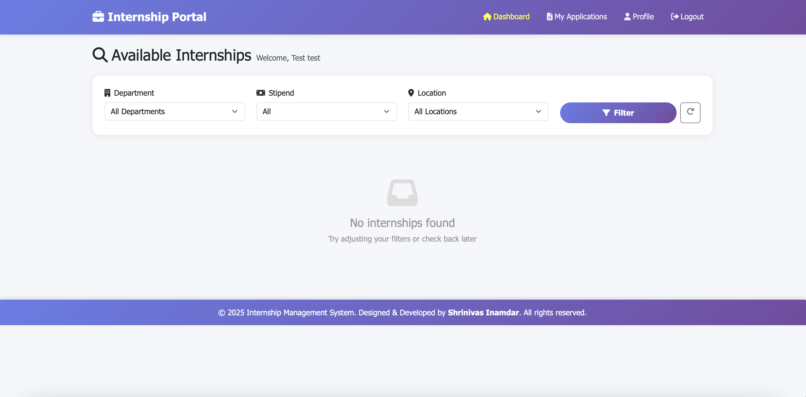
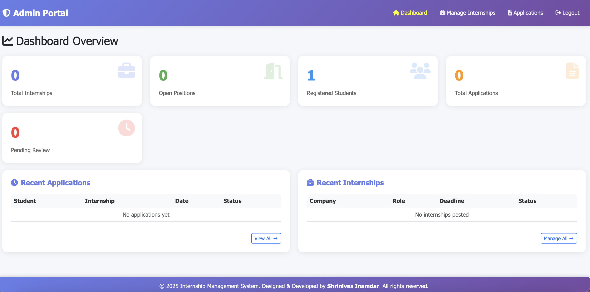

# Internship Management System

A simple and user friendly Internship Management System built using PHP and MySQL.  
This project allows admins to post internships and students to browse and apply.

---

## Screenshots

(Add your images by replacing the placeholders)

| Student Dashboard | Admin Dashboard |
|------------------|-----------------|
|  |  |

### Additional Screenshot


---

## Features

### Student Features
1. Register and login  
2. Browse internships  
3. Search internships  
4. Filter by department, location, stipend and type  
5. Apply for internships  
6. Upload resume  
7. Track application status  

### Admin Features
1. Login  
2. Post internships  
3. Edit or remove internships  
4. View applications submitted by students  

---

## Technologies Used

- PHP  
- MySQL  
- HTML  
- CSS  
- JavaScript  

---

## How To Run This Project Locally Using XAMPP

### Step 1: Install XAMPP
Download and install XAMPP from  
https://www.apachefriends.org

Start:
- Apache  
- MySQL  

### Step 2: Move Project Files
Copy the project folder and paste it inside the XAMPP htdocs directory: C:\xampp\htdocs\INTERNSHIP-MANAGEMENT-SYSTEM

### Step 3: Create the Database
1. Open phpMyAdmin  
2. Click New  
3. Create a database (example: internship_db)  
4. Click Import  
5. Upload the SQL file included in the project  

### Step 4: Update dbconnect.php
Edit the database configuration:

```php
$host = "localhost";
$user = "root";
$pass = "";
$dbname = "internship_db";
$conn = mysqli_connect($host, $user, $pass, $dbname);

